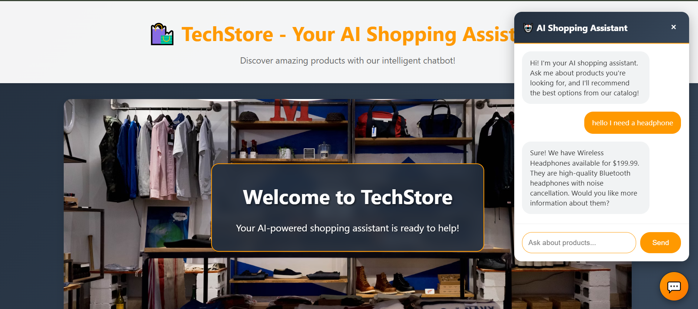

# E-commerce AI Chatbot

> An intelligent shopping assistant powered by OpenAI GPT that provides personalized product recommendations.



---

## Features

- **AI-Powered Recommendations** - Smart product suggestions using OpenAI GPT-3.5
- **Amazon-Inspired Design** - Professional UI with Amazon's signature color scheme
- **Real-time Chat Interface** - Smooth messaging with typing indicators
- **Responsive Design** - Works perfectly on desktop and mobile
- **Fast Performance** - Built with FastAPI for high-speed responses
- **Automatic Database** - SQLite with pre-seeded product catalog

## Tech Stack

| Frontend                | Backend             | AI/ML                       |
| ----------------------- | ------------------- | --------------------------- |
| HTML5, CSS3, JavaScript | FastAPI, SQLAlchemy | OpenAI GPT-3.5-turbo        |
| Responsive Design       | SQLite Database     | Natural Language Processing |

## Quick Start

### 1. Clone & Install

```bash
git clone <repository-url>
cd "E-commerce Chatbot with Product Recommendations"
pip install -r requirements.txt
```

### 2. Setup OpenAI API

```bash
# Get your API key from: https://platform.openai.com/api-keys
# Update .env file:
OPENAI_API_KEY=your-api-key-here
```

### 3. Run Application

```bash
python main.py
```

Visit: `http://localhost:9876` 

## Usage Examples

Try these sample queries with the chatbot:

- *"I need wireless headphones for working out"*
- *"Show me home appliances under $100"*
- *"What fitness equipment do you recommend?"*
- *"I'm looking for electronics"*

## Product Catalog

| Category              | Products                        |
| --------------------- | ------------------------------- |
| **Electronics** | Wireless Headphones, Smartphone |
| **Fitness**     | Yoga Mat, Resistance Bands Set  |
| **Home**        | Coffee Maker, Air Purifier      |

### Add More Products

```python
# In database.py
products = [
    Product(name="Your Product", description="Description", 
            category="Category", price=99.99)
]
```

<div align="center">

**Built with ❤️ using FastAPI, OpenAI, and modern web technologies**

⭐ Star this repo if you found it helpful!

</div>
